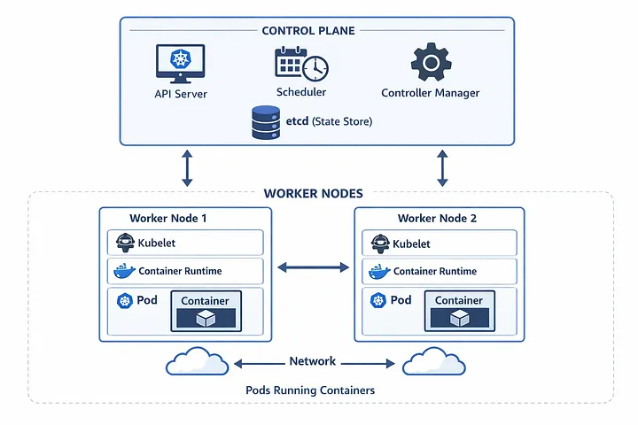

# Kubernetes Explained Simply

A beginner-friendly guide to what Kubernetes is, where it came from, and how every part of its architecture works.

---

## 1. A Short History of Kubernetes

| Year | What happened |
|------|---------------|
| Early 2000s | Google builds **Borg**, an internal system that runs billions of containers a week across its data centers. |
| ~2013 | Google builds a second system called **Omega**, improving on Borg's design. |
| 2013 | **Docker** is released and makes containers popular with everyone, not just Google. |
| 2014 | Google engineers (Joe Beda, Brendan Burns, Craig McLuckie) create **Kubernetes** as an open-source project, based on lessons learned from Borg and Omega. It is written in the Go language. |
| 2015 | **Kubernetes 1.0** is released. Google donates it to the newly created **CNCF** (Cloud Native Computing Foundation). |
| 2018 | Kubernetes becomes the first project to "graduate" from the CNCF, meaning it is mature and widely trusted. |
| Today | Kubernetes is the industry standard for running containers. AWS (EKS), Google Cloud (GKE) and Azure (AKS) all offer managed versions. |

**About the name:** *Kubernetes* is a Greek word meaning "helmsman" or "ship pilot". That is why the logo is a ship's steering wheel. It is often written **K8s** (K, then 8 letters, then s).

---

## 2. What Is Kubernetes?

Kubernetes is a **container orchestration platform**. It automatically deploys, scales, heals and manages containerized applications across many machines.

### The problem it solves

Running one container on your laptop is easy:

```bash
docker run nginx
```

But in real life you might have:

- 200 containers
- spread over 20 servers
- that must restart if they crash
- scale up during a sale, and scale down at night
- update without any downtime

Doing this by hand is impossible. Kubernetes does it for you.

### The one big idea

You tell Kubernetes the **desired state** ("I want 3 copies of my website running"). Kubernetes then works constantly to make the **actual state** match it. If a copy crashes, Kubernetes starts a new one automatically.

---
## 3. The Architecture Diagram


The diagram has two big areas:

1. **Control Plane** (top): the brain that makes decisions.
2. **Worker Nodes** (bottom): the machines that do the actual work of running your apps.

The double-headed arrows between them mean they constantly talk to each other: the control plane sends instructions down, and the nodes report their status back up.

### The analogy we will use: a restaurant

To make everything easy to remember, think of Kubernetes as a **restaurant**:

| Kubernetes | Restaurant |
|------------|-----------|
| Control Plane | The management office |
| API Server | The reception desk where all orders are taken |
| etcd | The order notebook (record of everything) |
| Scheduler | The manager who decides which kitchen cooks which order |
| Controller Manager | The supervisor who checks "do we have enough dishes ready?" |
| Worker Node | A kitchen |
| Kubelet | The head chef of that kitchen |
| Container Runtime | The stove and cooking tools |
| Pod | A serving tray |
| Container | The actual dish on the tray |
| Network | The hallways and waiters connecting the kitchens |

---

## 4. Every Component Explained

### 4.1 Control Plane

**What it is:** The group of components that manage the whole cluster. It does not run your apps itself. It decides *what should run* and *where*.

**Example:** You type `kubectl apply -f app.yaml`. The control plane receives this request and coordinates everything that follows.

**Restaurant version:** The management office. Nobody cooks here, but all decisions are made here.

---

### 4.2 API Server

**What it is:** The single front door of Kubernetes. Every request goes through it: from you (`kubectl`), from other components, and from the nodes. It checks who you are, validates the request, and saves it.

**Example:**

```bash
kubectl get pods
```

Your command goes to the API server, which reads the data and sends back the list of pods.

**Restaurant version:** The reception desk. All orders and questions pass through it, and no one talks to the kitchen directly.

> In the diagram, the API Server is shown with the Kubernetes wheel icon on a monitor because it is the "face" of the cluster.

---

### 4.3 Scheduler

**What it is:** Decides *which worker node* a new pod should run on. It looks at:

- free CPU and memory on each node
- rules you set (for example, "only run on nodes with a GPU")
- spreading pods out so one node is not overloaded

**Example:** You create a pod that needs 2 GB of memory.

- Node 1 has 1 GB free, so it is too small.
- Node 2 has 6 GB free, so it is a good fit.

The Scheduler chooses **Node 2**.

**Restaurant version:** The manager who says "Kitchen 2 is less busy, send this order there."

> The Scheduler only *decides*. It does not start the pod. The kubelet does that later.

---

### 4.4 Controller Manager

**What it is:** A set of "control loops" that continuously compare the **desired state** with the **actual state** and fix any difference.

**Example:** You asked for **3 replicas** of your website.

1. One node crashes and 1 pod disappears, so only **2** are running.
2. The controller notices: "Desired = 3, Actual = 2".
3. It creates a new pod to get back to **3**.

This is how Kubernetes "self-heals".

**Restaurant version:** The supervisor who counts the trays: "We promised 3 dishes ready, only 2 are on the counter. Cook another one!"

---

### 4.5 etcd (State Store)

**What it is:** A small, fast database that stores the **entire state of the cluster**: which pods exist, which nodes are healthy, all your configuration and secrets. Only the API Server talks to it directly.

**Example:** Your `app.yaml` says "3 replicas". That number is saved in etcd. If the control plane restarts, it reads etcd and remembers everything.

**Restaurant version:** The order notebook. If the manager leaves and a new one arrives, the notebook tells them exactly what was ordered.

> Because etcd holds everything, it is usually backed up regularly in real clusters.

---

### 4.6 Worker Nodes

**What they are:** The machines (physical servers or virtual machines) that actually run your applications. A cluster can have from 1 to thousands of them. The diagram shows two: **Worker Node 1** and **Worker Node 2**.

Each node contains three main things you can see in the diagram: **Kubelet**, **Container Runtime** and **Pods**.

**Restaurant version:** Each worker node is one kitchen.

---

### 4.7 Kubelet

**What it is:** An agent that runs on every worker node. It is the node's link to the control plane. It:

- receives instructions from the API Server ("run this pod")
- tells the container runtime to start the containers
- checks that containers are healthy
- reports the status back to the control plane

**Example:** The Scheduler assigned a pod to Node 1. The kubelet on Node 1 sees the assignment, starts the pod, and later reports "Pod is running".

**Restaurant version:** The head chef of the kitchen. They get the order slip and make sure it gets cooked and served.

---

### 4.8 Container Runtime

**What it is:** The software that actually **pulls images and runs containers**. Common runtimes are **containerd** and **CRI-O**. (Docker was used in the past, and its whale icon appears in the diagram.)

**Example:** The kubelet says "run `nginx:1.25`". The container runtime downloads the nginx image and starts it as a container.

**Restaurant version:** The stove, pots and pans. The chef (kubelet) decides what to cook, but the stove (runtime) does the cooking.

---

### 4.9 Pod

**What it is:** The **smallest unit** in Kubernetes. A pod wraps one or more containers that:

- share the same IP address
- share storage
- always run together on the same node

Most of the time, one pod = one container.

**Example:** A pod with two containers:

- container 1: your web app
- container 2: a helper that collects logs

Both live in the same pod because they work closely together.

**Restaurant version:** A serving tray. It usually carries one dish, but sometimes a dish plus a side.

---

### 4.10 Container

**What it is:** The packaged application: your code plus everything it needs (libraries, runtime, settings). It runs the same way on any machine.

**Example:** A container built from the `nginx` image serves web pages. A container built from your own Node.js app serves your API.

**Restaurant version:** The actual dish on the tray.

---

### 4.11 Network (bottom of the diagram)

**What it is:** The connection that lets pods and nodes talk to each other. Kubernetes gives every pod its own IP address, and any pod can reach any other pod, even if they are on different nodes. This is what the arrow between **Worker Node 1** and **Worker Node 2** and the cloud icons show.

**Example:** Your web app pod on Node 1 needs to call your database pod on Node 2. Thanks to the cluster network, it simply connects to the database's address, with no extra setup.

**Restaurant version:** The hallways and waiters that carry things between kitchens.

---

### 4.12 The Arrows in the Diagram

| Arrow | Meaning |
|-------|---------|
| Control Plane ↕ Worker Nodes | The control plane sends instructions down, and nodes send status reports up. |
| Worker Node 1 ↔ Worker Node 2 | Pods on different nodes can talk to each other over the network. |
| Network ↔ Network (clouds) | Cluster-wide networking that links all the nodes together. |

---

## 5. Full Example: Deploying a Website Step by Step

Let's follow one real request through every component in the diagram.

### Step 0: Write the desired state

Save this as `app.yaml`:

```yaml
apiVersion: apps/v1
kind: Deployment
metadata:
  name: my-website
spec:
  replicas: 3            # I want 3 copies
  selector:
    matchLabels:
      app: my-website
  template:
    metadata:
      labels:
        app: my-website
    spec:
      containers:
        - name: web
          image: nginx:1.25
          ports:
            - containerPort: 80
```

### Step 1: Send it

```bash
kubectl apply -f app.yaml
```

### Step 2: What happens inside the cluster

| Step | Component | What it does |
|------|-----------|--------------|
| 1 | **API Server** | Receives your request, checks it is valid, and accepts it. |
| 2 | **etcd** | Saves "my-website: 3 replicas" as the desired state. |
| 3 | **Controller Manager** | Sees "wanted 3, have 0" and creates 3 pod records. |
| 4 | **Scheduler** | Assigns Pod 1 and Pod 2 to Node 1, and Pod 3 to Node 2, based on free resources. |
| 5 | **Kubelet** (on each node) | Sees its new pods and asks the runtime to start them. |
| 6 | **Container Runtime** | Pulls `nginx:1.25` and starts the containers. |
| 7 | **Pods / Containers** | Now running and serving your website. |
| 8 | **Kubelet** | Reports "all pods running" back to the API Server. |

### Step 3: Check the result

```bash
kubectl get pods -o wide
```

Example output:

```
NAME                          READY   STATUS    NODE
my-website-7d9f8b6c5-abcde    1/1     Running   worker-node-1
my-website-7d9f8b6c5-fghij    1/1     Running   worker-node-1
my-website-7d9f8b6c5-klmno    1/1     Running   worker-node-2
```

### Step 4: Watch the self-healing

Delete one pod on purpose:

```bash
kubectl delete pod my-website-7d9f8b6c5-abcde
```

Within seconds the **Controller Manager** notices only 2 pods remain, creates a new one, the **Scheduler** picks a node, and the **Kubelet** starts it. You are back to 3 pods without doing anything.

### Step 5: Scale up in one command

```bash
kubectl scale deployment my-website --replicas=5
```

Kubernetes creates 2 more pods and spreads them across the nodes.

---

## 6. Bonus: One Component Not Shown in the Diagram

**kube-proxy** also runs on every worker node. It manages the network rules that let traffic reach the right pod. When a user visits your website, kube-proxy helps route the request to one of your 3 pods, sharing the load between them.

---

## 7. Quick Summary

- **Kubernetes** is an open-source container orchestrator, born from Google's Borg system and released in 2014.
- The **Control Plane** is the brain: **API Server** (front door), **etcd** (memory), **Scheduler** (placement), **Controller Manager** (keeps reality matching your wishes).
- **Worker Nodes** are the muscle: **Kubelet** (node agent), **Container Runtime** (runs containers), **Pods** (wrappers around containers).
- You declare **what you want**, and Kubernetes keeps making it true.

---

## 8. Try It Yourself

The easiest way to practice on your own computer:

```bash
# Option 1: minikube
minikube start
kubectl get nodes

# Option 2: kind (Kubernetes in Docker)
kind create cluster
kubectl get nodes
```

Then try the `app.yaml` example above and watch the components work.
