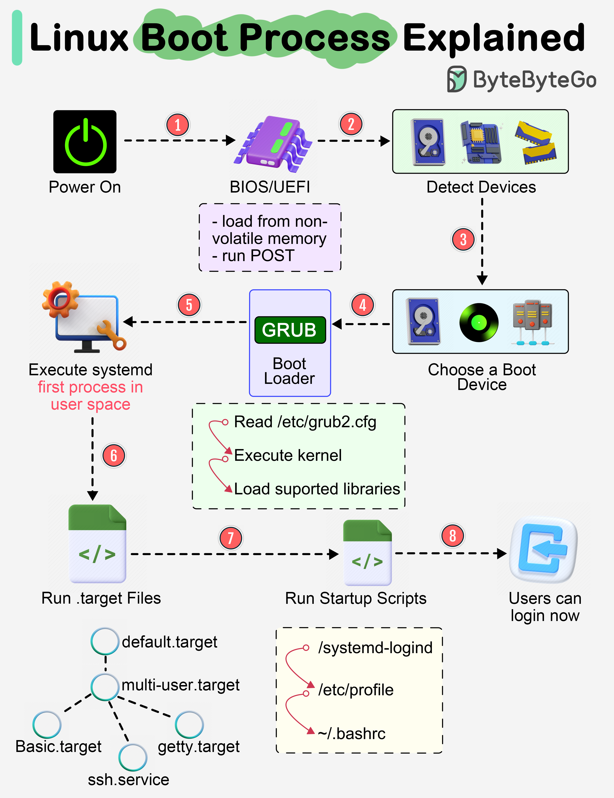

# Linux Boot Process 


**Source:** [ByteByteGo — Linux Boot Process Explained](https://bytebytego.com/guides/linux-boot-process-explained/)



---

## Overview

```
Power On → BIOS/UEFI → POST → Boot Device Selection → Bootloader (GRUB)
→ Kernel Load → systemd (init) → Targets/Services → Login Screen
```

---

## Step 1: BIOS/UEFI Load & POST

কম্পিউটার অন করলে non-volatile memory থেকে **BIOS** (Basic Input/Output System) বা **UEFI** (Unified Extensible Firmware Interface) ফার্মওয়্যার লোড হয়। এটি **POST (Power On Self Test)** চালায়, যা হার্ডওয়্যার ঠিকমতো কাজ করছে কিনা যাচাই করে।

## Step 2: Hardware Detection
BIOS = Basic Input/Output System

এটি motherboard-এর firmware এবং operating system load হওয়ার আগে hardware initialization-এর কাজ শুরু করে।

BIOS/UEFI সিস্টেমের সাথে সংযুক্ত ডিভাইসগুলো শনাক্ত করে — CPU, RAM, স্টোরেজ ডিভাইস ইত্যাদি।

## Step 3: Boot Device Selection

কোন ডিভাইস থেকে OS বুট হবে তা নির্ধারণ করা হয়:
- Hard drive
- Network server
- CD-ROM / USB

## Step 4: Bootloader (GRUB) Execution

BIOS/UEFI বুটলোডার (সাধারণত **GRUB**) রান করে, যা OS বা কার্নেল বেছে নেওয়ার জন্য একটি মেনু দেখায়।

GRUB-এর প্রধান কাজ:
Linux kernel খুঁজে বের করা
Kernel memory-তে load করা
প্রয়োজনে kernel নির্বাচন করার সুযোগ দেওয়া
Kernel-এর সাথে initramfs load করা

## Step 5: Kernel Load & Switch to User Space

কার্নেল প্রস্তুত হওয়ার পর সিস্টেম **user space**-এ চলে যায়। কার্নেল প্রথম user-space প্রসেস হিসেবে **systemd** চালু করে, যা:
- প্রসেস ও সার্ভিস ম্যানেজ করে
- অবশিষ্ট হার্ডওয়্যার প্রোব করে
- ফাইলসিস্টেম মাউন্ট করে
- ডেস্কটপ এনভায়রনমেন্ট চালায়
Kernel-এর গুরুত্বপূর্ণ কাজ:

CPU management

Memory management

Process management

Device management

Drivers

Filesystem management

Networking

Security

সহজভাবে:

Kernel হলো Linux system-এর মূল manager।

## Step 6: Default Target Activation

systemd বুট হওয়ার সময় ডিফল্টভাবে **`default.target`** ইউনিট অ্যাক্টিভেট করে। প্রয়োজনীয় অন্যান্য ইউনিটও এসময় রান হয়।

## Step 7: Startup Scripts

সিস্টেম প্রয়োজনীয় স্টার্টআপ স্ক্রিপ্ট চালায় এবং এনভায়রনমেন্ট কনফিগার করে।

## Step 8: Login Screen

ব্যবহারকারীকে লগইন উইন্ডো দেখানো হয় — সিস্টেম এখন সম্পূর্ণ প্রস্তুত।

---

## Quick Reference Table

| Step | Stage | Key Component |
|------|-------|----------------|
| 1 | Firmware load & self-test | BIOS/UEFI, POST |
| 2 | Hardware detection | BIOS/UEFI |
| 3 | Boot device selection | BIOS/UEFI |
| 4 | Bootloader | GRUB |
| 5 | Kernel → user space | Kernel, systemd |
| 6 | Target activation | systemd (`default.target`) |
| 7 | Startup configuration | Startup scripts |
| 8 | User login | Login manager |

---

